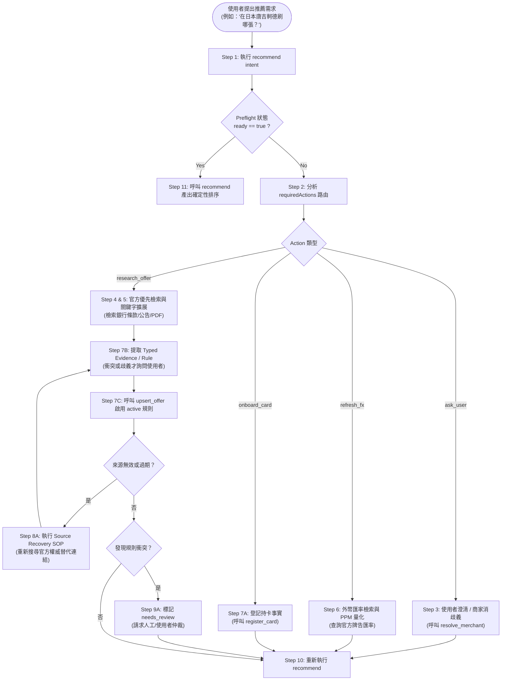

# Agent Research Skill 與 Recommendation Pre-flight 標準作業程序 (SOP)

> 正常商家消費意圖請直接呼叫 `recommend`，依
> [`recommendation-intent.md`](taiwan-card-rewards-skill/workflows/recommendation-intent.md)
> 執行；本 SOP 僅供舊 transaction branch 或明確診斷需求。正常流程不要求先列卡片
> 或先跑 `recommendation_preflight`。

**文件狀態**：正式營運指引 (Normative Agent SOP)
**適用範圍**：canonical 25-tool MCP contract（release tag 僅供部署管理）
**語言**：繁體中文
**遵循規範**：[`CONTEXT.md`](../../CONTEXT.md), [ADR 0001](../adr/0001-independent-card-rewards-domain-and-agent-supplied-rules.md), [ADR 0003](../adr/0003-complete-initial-mcp-surface-with-layered-trust-gates.md), [ADR 0004](../adr/0004-generic-benefit-status-and-schema-v2.md), [ADR 0005](../adr/0005-payment-route-opportunity-stacking.md), [ADR 0006](../adr/0006-multi-component-reward-ledger-and-cap-attribution.md), [ADR 0007 Payment-route facts](../adr/0007-provider-neutral-payment-route-facts-and-evidence.md), [Payment-route research](../research/payment-route-chain-reality-and-mcp-design.md), [使用者安裝與 Skill 分發 SOP](user-installation-and-skill-distribution-sop.md), [Schema v2 Spec](../specs/card-rewards-schema-v2-specification.md), [Agent-Supplied FX Spec](../specs/agent-supplied-fx-and-fail-closed-specification.md), [MerchantIdentity Spec](../specs/market-aware-merchant-identity-and-valid-offer-search-specification.md), [Pre-flight & Freshness Spec](../../.scratch/recommendation-preflight-evidence-freshness/spec.md).

---

## 1. 核心架構與責任邊界

### 1.1 Agent Workspace vs. MCP Server 責任分工
- **AI Agent (Research & Interaction Layer)**：
  - 負責理解使用者的自然語言、口語暱稱、查詢意圖與多情境消費需求。
  - 負責執行外部網路檢索（Web Browsing）、解析官方銀行網頁、閱讀 PDF/公告、進行 OCR 截圖分析與匯率查詢。
  - 擁有並管理 **Agent Workspace**（存放原始 HTML、PDF、截圖、OCR 文本、未驗證草稿與研究筆記）。
  - 將研究成果淬鍊為符合結構化型別契約（Typed Contract）的 **EvidenceRecord**、**FactCandidate** 與 **FxSnapshot**，提交給 MCP。
- **MCP Server (Deterministic Calculation & Storage Layer)**：
  - **零隱藏網路（Zero Network I/O）**：MCP 內部絕不發起任何 HTTP 請求、網路爬蟲或外部 API 呼叫。
  - **零猜測（Zero Guessing / Fail-Closed）**：缺失事實、過期資料或衝突條件時，一律 fail-closed 回傳結構化診斷（Diagnostics），絕不猜測或預設歸零。
  - **權威計算與帳本**：管理租戶隔離的信用卡資料庫、規則版本、上限池（CapPools）、實際交易記帳（`RecordedTransaction`）與退款沖銷。
  - **ID 權威擁有權**：MCP 擁有 Canonical ID（如 `mch_<ULID>`、`pool_<id>`、`snap_<id>`）之生成與指派權限；Agent 僅為提案方，不得自行宣告 ID。

### 1.2 隱私與敏感資料防護 (Privacy & Financial Data Boundary)
> [!CAUTION]
> **絕對禁止敏感欄位**：Agent 在與 MCP 通訊、提報交易或提交 Evidence 時，**嚴禁傳送**任何信用卡卡號（PAN）、末三碼（CVV/CVC）、一次性驗證碼（OTP）、網路銀行密碼、Cookie、Authorization Header、Token 或使用者私密憑據。MCP 遇到敏感欄位將立即拋出 `SENSITIVE_FIELD_FORBIDDEN` 並中斷操作。

---

## 2. Canonical 25-tool MCP 合約體系

MCP 伺服器公開 19 項標準工具，Agent 必須依照其唯讀與寫入屬性合規調用；完整清單與 closed schema 見 [`taiwan-card-rewards-skill/references/mcp-tools.md`](taiwan-card-rewards-skill/references/mcp-tools.md)：

| 工具名稱 | 屬性 | 核心職責 | 主要 Fail-Closed 狀態碼 |
|---|:---:|---|---|
| `recommendation_preflight` | 唯讀 | 推薦前置就緒檢查、缺漏事實盤點、Required Actions 指派 | `INVALID_INPUT`, `NEEDS_REVIEW` |
| `recommend` | 唯讀 | 基於有效規則與帳本實際額度，執行純確定性信用卡推薦排序 | `INSUFFICIENT_FACTS`, `NEEDS_REVIEW`, `STALE` |
| `calculate_reward` | 唯讀 | 單筆指定規則之純數學回饋試算（不碰持久化狀態） | `INSUFFICIENT_FACTS`, `NEEDS_REVIEW`, `STALE` |
| `rank_cards` | 唯讀 | 多卡多規則之純排序評估（不碰持久化狀態） | `INSUFFICIENT_FACTS`, `NEEDS_REVIEW`, `STALE` |
| `resolve_merchant` | 唯讀 | 商家實體前置解析、別名查詢與市場消歧義 | `INVALID_INPUT`, `STORE_UNAVAILABLE` |
| `search_active_offers` | 唯讀 | 探索已啟用、來源可信且效期內之優惠規則 | `INVALID_INPUT`, `STORE_UNAVAILABLE` |
| `list_cards` | 唯讀 | 列出使用者已登記之信用卡清冊與卡片屬性 | `STORE_UNAVAILABLE` |
| `remaining_caps` | 唯讀 | 查詢指定卡片之各上限池實際剩餘額度 | `CARD_NOT_FOUND`, `INSUFFICIENT_FACTS` |
| `get_user_benefit_status` | 唯讀 | 查詢權益切換 (card_switch) 或登錄活動 (campaign) 狀態 | `CARD_NOT_FOUND`, `STORE_UNAVAILABLE` |
| `list_payment_routes` | 唯讀 | 查詢使用者登記之支付路徑清冊（支援有界分頁） | `INVALID_INPUT`, `STORE_UNAVAILABLE` |
| `register_payment_account` | 寫入 | 登記 wallet/linked bank account opaque identity 與 evidence | `INVALID_INPUT`, `SENSITIVE_FIELD_FORBIDDEN` |
| `list_payment_accounts` | 唯讀 | 列出可供 payment route 引用的 account identities | `INVALID_INPUT`, `STORE_UNAVAILABLE` |
| `register_card` | 寫入 | 登記或更新使用者持卡屬性（發卡行、產品名、結帳日、時區） | `INVALID_INPUT`, `STORE_UNAVAILABLE` |
| `upsert_offer` | 寫入 | 儲存來源快照 (Snapshot)、規則版本 (Rule)，並可一併附帶確認書 (Confirmation) | `INVALID_OFFER`, `INVALID_CONFIRMATION` |
| `upsert_payment_route` | 寫入 | 登記或更新確認/候選支付路徑拓撲與扣款來源（絕不儲存敏感憑據） | `INVALID_INPUT`, `IDEMPOTENCY_CONFLICT`, `SENSITIVE_FIELD_FORBIDDEN` |
| `upsert_user_benefit_status` | 寫入 | 記錄使用者確認已完成之權益切換或活動登錄事實 | `CARD_NOT_FOUND`, `INVALID_CONFIRMATION` |
| `record_transaction` | 寫入 | 記錄實際消費或關聯退款至持久化帳本，更新上限池消耗 | `IDEMPOTENCY_CONFLICT`, `INVALID_REFUND` |
| `record_event_reward` | 寫入 | 重算 event-local rule 或 explicit `funded_by` chain 後記錄回饋 | `NO_MATCH`, `INSUFFICIENT_FACTS`, `NEEDS_REVIEW` |
| `reverse_event_reward` | 寫入 | 依 explicit refund relation 反轉一筆 event reward | `INVALID_REFUND_RELATION`, `OVER_REFUND` |

`recommend` 是 closed union：卡片 branch 使用 nested `transaction`；多層路徑
使用 `{ "kind": "payment_path", "payment_path": { "amount": ... } }`。後者
只從 current user 的 active/confirmed、accepted official-evidence routes 產生
bounded candidates 與 planned events，不寫 ledger，也不替混合 wallet 推 FIFO/LIFO。
目前 CLI 尚未轉送 payment-path 的 `eligibilityFacts`，因此 Gold/member-dependent
path recommendation 在該 parity gap 修復前必須回報 blocked/needs_review。

---

## 3. 標準研究與推薦工作流程 (End-to-End SOP)



### Step 1: 發起前置檢查 (`recommendation_preflight`, legacy)
在使用舊 transaction branch 或需要獨立診斷時，Agent 組裝目前已知的交易條件（金額、幣別、商家口語、支付方式、國家等），呼叫 `recommendation_preflight`。商家意圖的正常入口直接呼叫 `recommend`，不經此步驟。

### Step 2: 解析 `requiredActions` 與診斷分流
檢查回傳的 `ready` 旗標：
- 若 `ready: true`：直接進入 **Step 11** 執行推薦。
- 若 `ready: false`：遍歷 `requiredActions` 陣列，依據 `actionType` 精準分流：
  - `clarify_merchant` / `choose_market` $\rightarrow$ 進入 **Step 3**。
  - `refresh_external_data` (類別為 `fx_rate`) $\rightarrow$ 進入 **Step 6**。
  - `research_evidence` / `refresh_offer` $\rightarrow$ 進入 **Step 4 & 5**。
  - `register_card` $\rightarrow$ 進入 **Step 7A**。
  - `review_conflict` $\rightarrow$ 進入 **Step 9**。

### Step 3: 商家消歧義與用戶確認 (Merchant Disambiguation)
1. **呼叫 `resolve_merchant`**：傳入 raw query 與 country/market 參數。
2. **比對優先級**：
   - Precedence 1: Exact Canonical ID (`mch_<ULID>`)。
   - Precedence 2: NFKC Normalized Key Match（全半形/大小寫/空白壓縮/標點去除）。
   - Precedence 3: Bounded Candidates（歧義候選）。
3. **歧義處理**：若有多個實體（如台灣 7-11 vs 日本 7-Eleven），Agent **絕不自行代選**，必須向使用者呈現最多 10 筆候選選項並提問。

### Step 4: 官方優先來源檢索策略 (Official-First Source Priority)
當需要補足優惠規則或特定特店條款時，Agent 檢索必須遵循嚴格的來源層級：
1. **Tier 1 (最權威 - Official First)**：發卡銀行官方活動頁、信用卡權益總覽、官方 PDF 條款、電子支付機構（全支付、街口、LINE Pay 等）官方公告。
2. **Tier 2 (次要參考 - Trusted Secondary)**：國際卡組織（Visa/Mastercard/JCB）官方匯率/促銷頁面、大型連鎖特店官方網站。
3. **Tier 3 (線索發現 - Community Observation)**：論壇、部落格、社群討論。**社群情報僅能作為搜尋線索，絕對不能直接當作 Authoritative Evidence 啟用規則**；必須沿線索找到 Tier 1 官方來源佐證。

### Step 5: 搜尋維度擴展 (Search Query Expansion)
Agent 進行 Web Search 時，應結構化拓展關鍵字組合：
- `[發卡銀行] [卡片名稱] [年份/月份] 權益 官方網站`
- `[發卡銀行] [卡片名稱] [特店/支付名稱] 回饋 上限 登錄 排除通路`
- `[支付錢包名稱] [合作銀行] [活動期間] 點數回饋 條款 PDF`

### Step 6: 支付路徑與外幣匯率研究 (Payment Route & FX SOP)
1. **支付路徑解構**：識別交易是 `direct_card`、`wallet`（如 LINE Pay、街口）還是 `merchant_app`（如瘋 Pay、skm pay）。
2. **外幣匯率檢索**：
   - 查詢發卡行或中央銀行公告之即時/歷史牌告匯率（現金賣出/即期賣出）。
   - **PPM 量化換算**：將浮點匯率 $R = \frac{\text{Quote}}{\text{Base}}$ 轉換為百萬分之一（PPM）整數：
     $$\text{ratePpm} = \lfloor R \times 1,000,000 + 0.5 \rfloor$$
   - 組裝 `FxSnapshot`，附帶 `capturedAt`、`provider` 與 `sourceUrl`。
3. **手續費與 Net Basis**：確認海外交易手續費（通常 1.5%）與點數折抵後之淨結算金額（`settlementAmount`）。

### Step 7: 結構化 Evidence 提交與啟用 (Typed Submission & Activation)
1. **生成候選規則**：組裝 `OfferRuleVersion`，宣告 `match`（或 `predicate`）、`reward`（費率、回饋幣別、進位方式）、`capPoolRefs`（關聯上限池）。
2. **預設啟用有證據候選**：有一致的官方證據時直接以 `status: "active"` 提交；只有來源衝突、商家歧義或使用者表示不可用時，才標記 `needs_review`／`failed` 或詢問使用者。
3. **呼叫 `upsert_offer`**：提交 `snapshot`、`rule` 與 `capPools`。若確實需要確認才附 `confirmation`；缺少外幣政策時附 `fxPolicyRequirement`，讓回應產生 `research_fx_policy` action。

### Step 8: 來源失效修復 (Source Recovery SOP)
若已儲存之官方來源 URL 發生 404、網頁改版或過期（`stale`）：
1. Agent 在 Agent Workspace 重新搜尋該銀行或活動之最新官方網址。
2. 驗證新網頁內容與優惠條款。
3. 產生新的 `sourceSnapshot`（具備新 `fetchedAt`、`contentHash` 與 `version`）。
4. 呼叫 `upsert_offer` 建立新版規則或更新快照，絕不要求 MCP 自行修復網路連結。

### Step 9: 衝突與新鮮度處置 (Conflict & Freshness Handling)
- 若不同官方來源出現矛盾條款（例如官網寫 5% 但 PDF 寫 3%）：
  - 標記為 `needs_review`。
  - 提示使用者存在來源衝突，展示矛盾點並請求使用者確認依據何者計算。
  - **嚴禁 Agent 自行取平均值或擅自採信最新時間**。

### Step 10: 重新執行推薦 (`rerun recommendation`)
在完成事實登記、匯率注入或優惠啟用後，Agent 重新呼叫同一個 `recommend` intent；只有 legacy transaction 或明確診斷需求才重跑 `recommendation_preflight`。

### Step 11: 確定性推薦與呈現 (`recommend`)
1. 呼叫 `recommend`（可指定 `limit` 1..20；card branch 預設 10）。
2. 向使用者呈現清晰排名的推薦結果：
   - 卡片名稱與預估淨回饋金額。
   - 回饋結構分解（Base Rule 回饋 + 特店加碼 + 支付錢包加碼）。
   - 上限池扣減狀態與剩餘額度。
   - 若特定加碼因條件不足未觸發，展示 Base Rule 回饋並附帶未命中說明。

---

## 4. 嚴格禁止事項 (Forbidden Anti-Patterns)

> [!WARNING]
> 以下行為嚴重破壞系統一致性與安全邊界，Agent 於任何情境下皆**嚴格禁止**執行：

1. **嚴禁 Fuzzy Auto-Accept**：絕不能因語意相近（如「星巴克」與「星宇航空」）或模糊搜尋分數高，未經用戶確認即自動判定為同一商家。
2. **嚴禁 1:1 FX Fallback**：外幣交易缺少匯率快照時，絕不能預設 1:1 匯率或自行估算匯率計算金額；必須 fail-closed 要求注入 `FxSnapshot`。
3. **嚴禁 MCP 內部發起網路連線**：所有搜尋、網頁抓取、API 請求均在 Agent 端執行，MCP 保持純本地無網路運作。
4. **嚴禁 Raw 檔案寫入 MCP Durable State**：PDF 原始二進位檔、HTML 原始碼、截圖與 OCR 巨量文本留存於 Agent Workspace，進 MCP 者僅限結構化 Typed Facts。
5. **嚴禁社群情報直接轉為 Authoritative Rule**：未經 Tier 1 官方來源佐證與使用者 `OfferConfirmation` 之情報，不得啟用為 `active` 規則。
6. **嚴禁推薦流程自動寫入資料**：`recommend` 與 `calculate_reward` 均為純唯讀工具，嚴禁在推薦評估期間暗中新增卡片、商家或規則。

---

## 5. 實例演練：診斷、失敗與重試範例

### 範例 A：缺少外幣匯率快照 (Missing FX Snapshot)
- **場景**：使用者詢問「在日本實體店刷 10,000 日圓，推薦哪張卡？」，但 transaction 缺少 `fx` 欄位。
- **Preflight 回傳**：
  ```json
  {
    "ready": false,
    "diagnostics": [{
      "code": "missing_fx_snapshot",
      "path": "transaction.fx",
      "requiredFacts": ["transaction.fx.ratePpm", "transaction.fx.provider"],
      "retryAction": "refresh_external_data"
    }],
    "requiredActions": [{
      "actionType": "refresh_external_data",
      "targetCategory": "fx_rate",
      "scope": { "baseCurrency": "JPY", "quoteCurrency": "TWD" }
    }]
  }
  ```
- **Agent SOP 處置**：
  1. 檢索台幣對日圓官方即時牌告匯率（例如 1 JPY = 0.2150 TWD）。
  2. 計算 PPM：$0.2150 \times 1,000,000 = 215,000$。
  3. 組裝 `fx: { baseCurrency: "JPY", quoteCurrency: "TWD", ratePpm: 215000, capturedAt: "2026-09-06T10:00:00Z", provider: "BankOfTaiwan" }`。
  4. 重新發起 preflight 並完成推薦。

### 範例 B：商家跨市場歧義 (Merchant Ambiguous)
- **場景**：使用者詢問「在唐吉軻德消費刷哪張？」，未指定國家。
- **Preflight 回傳**：
  ```json
  {
    "ready": false,
    "diagnostics": [{
      "code": "merchant_ambiguous",
      "path": "transaction.merchant",
      "requiredFacts": ["transaction.country"],
      "retryAction": "ask_user_to_choose_market"
    }]
  }
  ```
- **Agent SOP 處置**：
  1. 呼叫 `resolve_merchant(query: "唐吉軻德")` 取得候選：台灣門市 (`TW`) vs 日本門市 (`JP`)。
  2. 向使用者發問：「請問您是在台灣門市還是日本當地的唐吉軻德消費？」。
  3. 依據使用者回覆（如「日本門市」）設定 `country: "JP"`，重跑 preflight。

### 範例 C：商家無專屬優惠但具備基礎回饋 (No Active Offer with Base Rule)
- **場景**：使用者在某地方獨立小吃店刷卡，該店無任何銀行加碼活動。
- **Preflight / Recommend 行為**：
  - 商家解析結果標記 `status: "no_active_offer"`。
  - MCP **不中斷計算**，自動評估各卡片之「國內一般消費基礎規則」（例如 1%~2% 現金回饋）。
  - 產出推薦排序，並在 trace 中清楚註明「該商家適用一般消費回饋，無專屬加碼活動」。

---

## 6. 審計、版本追溯與自我檢核清單

每次完成推薦前，Agent 必須確認以下檢核清單：
- [ ] 是否已透過 `recommendation_preflight` 確認 `ready == true`？
- [ ] 商家實體是否已解析為標準 `mch_<ULID>` 或確認無專屬優惠？
- [ ] 外幣交易是否已包含非 1:1 之有效 `FxSnapshot`？
- [ ] 引用之優惠規則是否具備官方 URL 溯源與 `OfferConfirmation`？
- [ ] 所有卡片一般消費基礎回饋是否正常計算未被阻擋？
- [ ] 是否完全未涉及任何 PAN、CVV、OTP 等敏感資訊？
