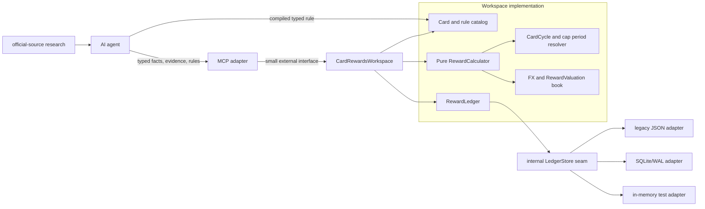

# Card Rewards codebase design

Status: draft design for v1 implementation

This document applies the `codebase-design` vocabulary to the independent Card
Rewards module described in [`CONTEXT.md`](../../CONTEXT.md) and ADR 0001. It is
a design and gap assessment; it does not change the current implementation.

## Design goal

The codebase must concentrate reward semantics in one deep module while keeping
the MCP protocol adapter thin. The module must support the agreed product
shape:

- the user can enter a card name before it is resolved to a Card Product;
- the AI agent researches official sources and supplies typed Offer Evidence and
  declarative Offer Rules;
- the Card Rewards module owns deterministic calculation, Card Cycle and Reward
  Cap accounting, FX/valuation facts, and the Reward Ledger;
- the AI agent owns questions, contextual Recommendation, and final preference;
- planned evaluation never mutates the Reward Ledger;
- actual recording is idempotent, refund-linked, and fail-closed;
- native reward units and all relevant currencies remain visible in results.

The module must not accept `user_id`, a filesystem path, a token, or arbitrary
source-fetch instructions in a business request. User identity is established
by the trusted process parent or sidecar ingress and bound to the persistence
implementation before this module is constructed.

## Proposed module map



The `MCP adapter` is intentionally a small adapter. It translates JSON-RPC
requests, removes transport concerns, and maps errors to the protocol. It does
not calculate rewards, select a Card Product, or decide which card is best.

The `CardRewardsWorkspace` is the external seam. Its implementation may use
small internal modules and internal seams, but callers do not need to know the
storage format, rule matching algorithm, cycle arithmetic, cap aggregation, or
FX lookup order.

## The external interface

The preferred interface has five semantic entry points. They are fewer than the
10-tool MCP surface because list/cap/history reads belong to one
inspection operation, and refund is a ledger operation rather than a separate
calculation authority.

```typescript
interface CardRewardsWorkspace {
  addCard(input: AddCardInput): CardRegistration;
  publishOffer(input: OfferPackage): OfferRevision;
  calculate(input: CalculationRequest): CalculationResult;
  record(input: LedgerCommand): LedgerResult;
  inspect(input: InspectionQuery): InspectionResult;
}
```

The names above are illustrative TypeScript, not a requirement to use a class.
The interface includes the following invariants, ordering rules, and error
modes, which are part of the interface even when they are not visible in the
type signature.

### `addCard`

`AddCardInput` accepts a user-provided `Card Alias` and an optional resolved
Card Product reference. It may return an `Unresolved Card`; that is a valid
stored state, not an anonymous fallback. The input cannot contain a PAN, full
card number, credential, or arbitrary path.

The operation is user-scoped by construction. A caller cannot select another
user by putting an identifier in the input. Replacing a Card Product reference
must preserve the alias and make the change visible in the audit history.

### `publishOffer`

`OfferPackage` contains dated Offer Evidence, one immutable Rule Version, and
the typed rule terms derived by the AI agent. Rule terms are data, never code.
The implementation validates:

- source, rule, validity interval, currency, reward unit, operator, and cap
  shapes;
- source-to-rule provenance and version references;
- no unsupported operator is silently ignored;
- no overlapping active Rule Versions are silently chosen;
- rule status transitions are explicit (`candidate`, `active`, `stale`,
  `superseded`, `needs_review`).

The Card Rewards module may reject an incomplete package, or store it as
`candidate`/`needs_review`; it must not make it active by guessing.

### `calculate`

`CalculationRequest` contains a Transaction Intent or a read-only actual
preview, selected card scope or a set of held cards, current Eligibility Facts,
and an explicit sort declaration when more than one result is requested.

The result is a `Reward Breakdown` (or a set of breakdowns) with:

- matched predicates, exclusions, and missing facts;
- native reward unit and amount;
- comparison value and valuation version, when supplied;
- original, settlement, reward, fee, and comparison currencies;
- Card Cycle and Cap Period used;
- FX Snapshot identity, provider/card scope, and captured time;
- Rule Version and Offer Evidence identity;
- gross value, cap consumption preview, and remaining cap preview;
- `unknown`, `stale`, `needs_confirmation`, or conflict reasons.

Calculation of a Transaction Intent never writes a cap or a transaction. A
missing or stale required fact cannot become a zero reward or an `ok` result.
An FX default means the latest explicitly configured, provenance-bearing
snapshot in the permitted age window; it does not mean an implicit TWD rate.
The result must expose its age and scope. When the snapshot exceeds the
configured maximum age (including the accepted one-week fallback window), the
agent is told to refresh or ask the user before treating the result as
confident.

Explicit sorting is allowed, for example by `net_value_twd` descending and then
`card_id` ascending for deterministic ties. The interface must not call this a
Recommendation or claim that the first result is the user's best card.

### `record`

`LedgerCommand` has two variants:

```typescript
type LedgerCommand =
  | { kind: "purchase"; idempotencyKey: string; transaction: ActualTransaction }
  | { kind: "refund"; idempotencyKey: string; refundOfTransactionId: string; transaction: RefundTransaction };
```

For a purchase, the implementation resolves the effective Rule Version,
Eligibility Facts, Card Cycle, FX Snapshot, Reward Valuation, and cap usage in
one atomic operation before writing the Recorded Purchase. It rejects an
unknown/stale/conflicting result unless the interface explicitly supports an
agent/user confirmation mode; confirmation must be represented in the record.

For a refund, `refundOfTransactionId` points to the Recorded Purchase, not to
an idempotency key. The original Rule Version and Card Cycle remain available
for the reversal, including after a cycle rollover. A second identical command
returns the original result; a different payload using the same key is an
idempotency conflict.

There is no separate "reset cap" write. Cap usage is derived from the ledger
for the Card Cycle or other Cap Period, so a new cycle naturally starts with a
new window and a refund restores the original window's consumption.

### `inspect`

`InspectionQuery` covers read-only views such as held cards, unresolved aliases,
active/candidate rules, current or historical cap state, FX snapshot age, and
ledger entries. Queries take a time (`asOf`) when history matters. They do not
accept user selection, storage paths, or caller-provided totals.

The implementation returns facts and traceable state, not a semantic card
Recommendation. If a query cannot establish its scope or required source, it
returns a typed failure rather than a cross-user or default-directory result.

## Interface alternatives

### Alternative A: one command/query interface

```typescript
interface CardRewardsWorkspace {
  evaluate(request: CalculationRequest): CalculationResult;
  execute(command: CardRewardsCommand): MutationResult;
  read(query: CardRewardsQuery): QueryResult;
}
```

This has only three entry points and can hide atomic sequencing effectively.
Its weakness is that a large command union becomes a second protocol. Callers
must learn many unrelated branches, and errors can become less local. It is a
reasonable transport shape, but its apparent smallness is partly paid for by a
large interface type.

### Alternative B: expose every internal module

```typescript
interface CardCatalog { /* ... */ }
interface RuleCatalog { /* ... */ }
interface RewardCalculator { /* ... */ }
interface RewardLedger { /* ... */ }
interface FxBook { /* ... */ }
interface CycleResolver { /* ... */ }
```

This makes each internal seam visible to the MCP adapter and to the agent. It
looks flexible, but it moves rule-version selection, cap atomicity, refund
linkage, and currency consistency into callers. The interface is shallow: the
caller must reproduce the orchestration that the module should own. It also
makes a change to cycle or rule semantics spread across many call sites.

### Selection: the five-entry workspace interface

Alternative A is useful as a protocol implementation detail and Alternative B
is useful for internal tests, but neither should be the primary domain seam.
The five-entry `CardRewardsWorkspace` keeps each common operation named and
typed while hiding orchestration. It gives the caller leverage over the hard
parts—cycle, cap, FX, provenance, idempotency, and refunds—without requiring it
to coordinate internal modules.

The selected seam is also a good locality point: changes to money and reward
semantics are made in the workspace implementation and its internal modules,
while the MCP adapter and AI agent remain stable. The deletion test supports
the choice: deleting the workspace would force calculation, cap aggregation,
refund reversal, and rule selection into every caller; therefore it earns its
seam.

## Internal modules and locality

| Module | Interface at its internal seam | Hidden implementation | Depth target |
|---|---|---|---|
| `CardRewardsWorkspace` | Five semantic operations above | orchestration, validation, atomic mutation, result assembly | Deep and externally stable |
| `RewardCalculator` | `calculate(rule, facts, transaction, context)` | predicate evaluation, reward units, integer arithmetic, cap preview, trace | Deep, pure, easy to test |
| `CardCycleResolver` | `resolve(card, capPeriod, at)` | billing-day edge cases, calendar periods, campaign windows, timezone policy | Deep enough to remove date arithmetic from callers |
| `FxAndValuationBook` | `resolve(currencyContext, asOf, policy)` | exact scoped snapshot, default age window, stale/refresh outcome, valuation version | Deep; never hides provenance |
| `RewardLedger` | atomic purchase/refund/usage/query operations | idempotency, immutable trace, cap aggregation, reversal linkage | Deep; sole accounting authority |
| `CardAndRuleCatalog` | product/alias and evidence/rule lookup | version selection, status transitions, unresolved card state | Medium/deep; no raw storage details |
| `MCP adapter` | JSON-RPC/tool translation | serialization and protocol errors only | Intentionally thin |
| `LedgerStore` | internal persistence operations | JSON migration now; SQLite/WAL later; test memory adapter | Internal seam only |

`RewardCalculator` must not read the filesystem or network. It receives a
resolved `EvaluationContext`, including an FX Snapshot and cap usage, and
returns a result. This puts the highest-risk money behavior behind one test
surface.

`RewardLedger` is the only module allowed to turn a successful calculation into
durable cap consumption. The calculator may produce a cap preview, but it
cannot mutate usage. This keeps `Transaction Intent` and `Recorded Purchase`
distinct.

`FxAndValuationBook` stores or receives snapshots with provider, issuer/card
scope, captured time, validity policy, and currency pair. It may use a
configured default only when that default is an actual snapshot with
provenance. A missing exact scope, expired snapshot, or conflicting snapshot
is an explicit unresolved outcome.

## Seam and adapter placement

### External process and identity seam

The Aion parent or sidecar ingress binds a trusted user context to the process
and its persistence adapter. `CardRewardsWorkspace` never receives a
caller-controlled `user_id` field. In stdio mode, the fixed canonical
user-scoped data directory is selected before construction. In sidecar mode,
the ingress verifies the signed context and selects the same logical scope.

The MCP adapter must reject tool fields such as `user_id`, `data_dir`, `path`,
`token`, and credential fields. Missing or malformed trusted scope fails at
startup; there is no guest, anonymous, or shared default.

### Persistence seam

`LedgerStore` is internal. The current implementation has a JSON `FileStore`.
The target has a SQLite/WAL adapter, and tests need an in-memory adapter. That
gives at least two real adapter shapes (production migration plus test
replacement), so the seam is justified. The external interface does not expose
SQL, file names, lock files, or migration details.

The store adapter must support atomic mutation or an equivalent transaction
primitive. The workspace must not implement read-modify-write cap accounting in
the MCP adapter.

### Public-source seam

Official-source research belongs to the AI agent or an agent-owned research
adapter. The Card Rewards module receives source-linked Offer Evidence and
typed Rule Versions. If a convenience fetcher remains, it is an adapter that
returns unverified evidence metadata; it cannot activate a rule or make a
Recommendation. This keeps public web changes out of the calculation seam and
prevents source text from becoming executable logic.

### FX seam

Remote FX retrieval is outside `RewardCalculator`. The calculator consumes a
snapshot. A provider adapter may populate the `FxAndValuationBook`, but each
snapshot records the provider, card/issuer scope, captured time, and source.
The lookup policy returns `fresh`, `provisional`, `stale`, `missing`, or
`conflict`; callers cannot collapse these states into a confident number.

### Clock seam

Time is injected into the workspace and calculator as an `asOf` value. The
implementation must not call the system clock in pure calculation code. This
is a small internal seam used by production and deterministic tests; it does
not belong in the MCP tool schema.

## Mapping from the current working copy

| Current file/module | Current role | Target responsibility | Design gap |
|---|---|---|---|
| `src/service.ts` | orchestration, storage, calculation selection, deterministic ranking | `CardRewardsWorkspace` orchestration only | currently mixes persistence, ranking, and calculation; refund lookup uses an idempotency key where the domain requires a transaction id |
| `src/evaluator.ts` | rule matching, reward arithmetic, cap preview, card ranking | `RewardCalculator` plus explicit sort utility | current match is fixed-field, not a general AST; usage is not scoped by Card Cycle; ranking is too close to Recommendation |
| `src/store.ts` | JSON state, process lock, atomic file replace | internal `LedgerStore` adapter | no SQLite/WAL, no separate ledger/cap/evidence records, stale lock recovery remains operational |
| `src/types.ts` | combined wire and domain types | domain-language types plus transport DTOs | no Held Card/Eligibility Fact/Enrollment/Plan Selection/Cycle Window model; `Currency`/storage numbers are too permissive in places |
| `src/validation.ts` | ingress shape checks | adapter validation plus domain invariant checks | no generic operator registry, no conflict detection, no complete currency/FX scope policy |
| `src/mcp-contract.ts` | tool descriptions | thin MCP adapter contract | `recommend` and `rank_cards` imply semantic authority; source retrieval remains outside the MCP |
| `src/startup.ts` | canonical data directory | process identity/persistence adapter | `--user` is currently metadata-only; parent-bound scope needs an explicit deployment contract before sidecar use |

## Implementation sequence

1. Split domain types from transport DTOs without changing persistence yet. Add
   `HeldCard`, `UnresolvedCard`, `EligibilityFact`, `CycleWindow`, native
   reward/valuation, and full `CurrencyContext` types.
2. Extract `RewardCalculator` as a pure module. Keep `calculate` read-only and
   move explicit sort into a separate deterministic utility; remove semantic
   `recommend` terminology from the domain seam.
3. Add `CardCycleResolver` and scope cap usage by `(card, cap period, usage
   group, rule version policy)`, not by rule id alone.
4. Make `RewardLedger` own atomic purchase/refund recording, using
   `refundOfTransactionId`, immutable calculation traces, and idempotency
   conflict checks.
5. Replace the JSON persistence adapter with SQLite/WAL behind the internal
   `LedgerStore` seam. Add migrations and keep the old adapter only for an
   explicit migration/rollback path.
6. Add the five-entry workspace facade and reduce the MCP adapter to request
   translation. Preserve compatibility aliases only as transport aliases, not
   as additional domain modules.
7. Move public-source fetching and source freshness prompts to the AI-agent
   orchestration path. Keep the MCP rule ingestion path typed and fail-closed.

## Test surface

Tests should cross the deepest useful interface rather than inspect storage
records directly:

- `RewardCalculator`: predicate trees, unsupported operators, integer/basis
  point arithmetic, native reward units, valuation, FX scope, stale outcomes,
  and cap preview;
- `CardCycleResolver`: billing-day boundaries, month-end clamping, timezone,
  calendar month, quarter, and campaign windows;
- `CardRewardsWorkspace`: unresolved card lifecycle, plan/enrollment facts,
  planned non-mutation, actual atomic recording, duplicate/conflicting
  idempotency, cycle rollover, refund restoration, and explicit sorting;
- `LedgerStore` adapters: atomicity, migration, and process-scope behavior;
- `MCP adapter`: JSON-RPC shape, rejected sensitive fields, missing trusted
  scope, and fail-closed error mapping.

The tests should assert observable results through each module's interface.
They should not depend on JSON file layout or SQLite table names unless they
are specifically testing that adapter.

## Acceptance criteria for this design

- A caller can calculate, record, refund, and inspect without knowing storage,
  cap-reset, FX lookup, or rule-selection internals.
- The MCP adapter contains no user-selection parameter and no reward arithmetic.
- An agent-supplied rule is declarative, source-linked, versioned, and
  validated; source retrieval does not activate it by itself.
- Card Cycle, Cap Period, FX Snapshot, Reward Valuation, Rule Version, and
  Eligibility Facts are present in every durable calculation trace that needs
  them.
- Missing, stale, conflicting, or unsupported information is observable and
  non-confident; the only permitted default is a provenance-bearing snapshot
  within an explicit age policy.
- Planned evaluation cannot alter the Reward Ledger, and a refund reverses the
  original transaction's accounting context rather than creating an unrelated
  purchase.
- The implementation can migrate from JSON to SQLite/WAL without changing the
  external workspace interface or the Card Rewards domain language.
