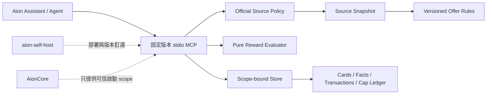

# taiwan-card-rewards-mcp 參考研究與產品規劃

## 1. 決策摘要

`taiwan-card-rewards-mcp` 應維持為獨立 public repository；`aion-self-host`
只負責整合契約、版本釘選、部署與驗證。信用卡 domain、規則解析、回饋計算與
user-scoped ledger 不放回 AionCore。

本次研究得到的方向是：

1. 借用 `tw-creditcard-vault` 的「來源優先、規則有版本、保存查核日期、未驗證
   不得直接推薦」治理方式。
2. 借用 `swipe-smart-mcp` 的 local stdio MCP 互動方式，以及卡片、規則、消費、
   cap bucket 等 domain 分層概念。
3. 不直接複製任何專案的程式碼、Markdown 內容或資料；我們需要自己的型別、
   授權邊界、幣別模型、帳單週期、冪等與 fail-closed 行為。
4. Phase 1 先做「一個 user、一個 stdio process、一個 canonical data-dir」；
   多 user 是可以支援的，但 user scope 必須由 Aion 的可信啟動邊界建立，不能靠
   assistant 傳入 `user_id`。

## 2. 兩個參考專案的比較

| 參考專案 | 它解決的問題 | 可借用 | 不應照搬 |
|---|---|---|---|
| [tw-creditcard-vault](https://github.com/tony13382/tw-creditcard-vault) | 公開信用卡資料與研究流程 | 官方來源優先、來源 URL、有效期間、cap、限制、排除條件、查核/複查日期、資料狀態 | 它是 Markdown/Obsidian 知識庫，不是 user ledger、交易帳本或交易時 evaluator |
| [swipe-smart-mcp](https://github.com/afzalmukhtar/swipe-smart-mcp) | local MCP 中的卡片推薦、消費記錄與回饋追蹤 | stdio 啟動、工具導向 UX、card/rule/expense/cap 的概念分層、類別/商家/平台匹配 | 相對路徑 SQLite、沒有可信 user binding、浮點計算、搜尋結果混合非官方來源、沒有完整 idempotency/refund/fail-closed |

### 委員會評估

| 面向 | Vault | Swipe Smart | 我們的採用結論 |
|---|---:|---:|---|
| 公開來源治理 | 5/5 | 2/5 | 採 Vault 的來源分級與 freshness |
| local MCP 互動 | 1/5 | 5/5 | 採 Swipe 的 stdio/tool 介面 |
| user-scoped persistence | 1/5 | 2/5 | 兩者都不足，自己建立 scope/lock/store |
| 回饋規則表達 | 3/5 | 4/5 | 採 Swipe 的 matcher/cap 概念，改為 typed、可版本化規則 |
| 計算可靠性 | 2/5 | 2/5 | 使用 integer minor units、basis points、FX snapshot、純函式 evaluator |
| 隱私與多 user | 4/5 | 1/5 | 不存敏感金融憑證，tool 不暴露 user/path，啟動時綁定 scope |

這些分數是架構取捨，不是對原專案品質的評價。

## 3. 目標架構



責任邊界：

- `AionCore`：驗證登入使用者、啟動 MCP、提供 canonical per-user data-dir 或
  未來提供窄 resolver seam；不理解銀行規則，也不直接寫 ledger。
- `taiwan-card-rewards-mcp`：擁有 domain schema、規則快照、計算器、交易帳本、
  lock、冪等、退款與來源 freshness。
- `aion-self-host`：保存 integration contract、compose/部署設定、固定版本與
  CI 入口；不成為信用卡資料的第二個 database。
- Assistant/Skill：負責對話流程與提問順序；不能自行計算、猜測 stale 規則，
  也不能自行指定 user、path 或 cap 使用量。

## 4. MCP 應包含什麼

### 4.1 公開規則資料

- `OfferSourceSnapshot`：官方 hostname、URL、取得時間、content hash、來源類型、
  HTTP/解析狀態、複查日期。
- `OfferRuleVersion`：`rule_id`、卡片產品、有效起訖、規則版本、回饋類型、
  basis points、幣別、適用國家/商家/MCC/通路/付款方式、排除條件。
- `RewardCondition`：需登錄、需切換方案、需電子帳單、需自動扣繳、最低消費、
  會員等級等可明確詢問的條件。
- `CapDefinition`：上限金額、計算幣別、週期類型、帳單結帳日/時區、全域或分類
  bucket、超過上限後的 waterfall 行為。
- `RuleStatus`：`active`、`stale`、`unknown`、`needs_review`、`conflict`；
  來源抓取失敗或規則解析不完整時，不能直接變成 active。

來源策略只允許設定的銀行官方 hostname。搜尋引擎或第三方網站可以幫忙找候選
URL，但不能作為未經審核的最終規則來源；不可登入銀行、不保存銀行 cookie、OTP、
網銀 token 或帳密。

### 4.2 使用者私有資料

- `CardDescriptor`：發卡行、卡片產品、使用者自訂別名、是否持有/停用；不保存
  PAN、CVV、有效期限。
- `UserEligibilityFacts`：使用者確認過的切換方案、登錄、扣繳、電子帳單、會員
  等級與帳單週期資訊，並記錄確認時間與來源。
- `Transaction`：planned/actual/refund、原始金額與幣別、入帳台幣金額、商家、
  MCC、地點、通路、付款方式、發生時間、採用的 rule/source version。
- `CapLedger`：依 user/card/rule/bucket/period 計算的已使用額度；actual 才寫入，
  planned 只做試算。
- `IdempotencyRecord` 與 `RefundLink`：避免重送重扣，退款必須指向原始交易。

所有資料都必須位於 server/parent 指定的 user scope；模型不可傳入或覆寫
`user_id`、`data-dir`、filesystem path。

## 5. 建議的 tool contract

Phase 1 的公開 tool 建議如下；名稱可與目前 working copy 漸進對齊：

| Tool | 用途 | 重要限制 |
|---|---|---|
| `list_cards` | 列出目前 user 已登錄卡片 | 只回傳該 process scope |
| `register_card` | 新增卡片產品/別名 | 不接受 PAN/CVV/帳密；不接受 user/path |
| `get_missing_facts` | 找出推薦前缺少的條件 | 只列可回答的必要條件 |
| `confirm_card_facts` | 保存使用者確認的切換/登錄/扣繳等狀態 | 帶有效時間與確認來源 |
| `refresh_public_offers` | 依官方 allowlist 取得/更新來源快照 | SSRF 防護、限制大小/時間；失敗標 stale/unknown |
| `recommend_cards` | 回傳最多五張卡 | 顯示 gross/net、cap、支付方式、條件、來源時間、rule version、信心狀態 |
| `get_cap_status` | 查剩餘回饋額度與可刷滿額金額 | 依正確帳單週期與時區計算 |
| `record_transaction` | 記錄 actual 消費 | 必須 idempotency key；同 key payload 不同就拒絕 |
| `refund_transaction` | 以原始交易為準做退款/沖銷 | 不接受孤立退款；保留可追溯關聯 |

`planned` 試算不應改變 cap ledger；`actual` 才能消耗額度。推薦輸出如果資料
不足，應回傳 `needs_confirmation`、`stale` 或 `insufficient_evidence`，而不是
猜一個前五名。

## 6. 推薦輸出最低內容

每一筆推薦至少要包含：

- 預估消費金額、幣別、FX snapshot 時間與估算手續費
- gross reward、net reward、net rate
- 基本回饋與每一項加碼的 breakdown
- 使用中的 cap、剩餘 cap、這筆消費後剩餘 cap
- 還能刷多少才會碰到 cap
- 建議支付方式、商家/MCC/地點匹配理由
- 必須先做的動作：切換、登錄、綁定或最低消費
- source URL、抓取時間、rule version、資料狀態
- `certain` / `conditional` / `unknown`，以及需要 user 回答的問題

排名不是單看百分比。先做硬性條件過濾，再用淨回饋金額、回饋率、條件信心、
操作摩擦與 cap 溢出狀況排序；同分時保留可解釋的 tie-breaker。

## 7. Fail-closed 與多 user 邊界

### 必須拒絕

- 缺少或過期的 user scope、data-dir、source、rule、FX 或 cap usage
- source hostname 不在 allowlist、redirect 到未允許 hostname、private IP 或
  DNS rebinding 風險
- 規則有衝突、有效期間不明、付款方式/商家條件未確認
- cap currency 與 settlement currency 不一致且沒有明確換算規則
- 相同 idempotency key 對應不同 payload
- data-dir lock 被其他 process 持有、資料損毀、schema 不相容或 path escape

### 多 user 執行模型

Phase 1 使用：

```text
authenticated user
  -> Aion/parent trusted resolver
  -> one MCP process + one canonical user data-dir
  -> tools without user_id/data-dir/path arguments
```

同一台機器可以有多個 user，但每個 user 必須是獨立的 process/data-dir scope。
`--user` 可以作顯示或 audit metadata，不能成為授權依據，也不能讓工具用它選擇
別人的資料目錄。Aion 若尚未提供可信 resolver，只能安全地做單一明確 profile，
不能宣稱 production-grade 多 user。

若未來同一 user 需要多 conversation、跨裝置或併發寫入，應把同一 evaluator
搬到 auth-aware HTTP sidecar/SQLite service；不要用多個 process 共寫 JSON 檔案。

## 8. 分階段實作計畫

### Phase 1：local stdio MVP（目前方向）

- 固定版本 npm package 與 stdio JSON-RPC
- canonical `--data-dir`、exclusive lock、atomic write
- 卡片登錄、官方來源快照、版本化 rule、recommend、planned 試算
- 先用 fixture 與少量官方來源，不做銀行登入

### Phase 2：可靠帳本

- actual transaction、cap period、idempotency、refund
- statement cycle/timezone、FX snapshot、excluded MCC、top-five golden tests
- unknown/stale/conflict 的回應與 Assistant 提問契約

### Phase 3：Aion 多 user 整合

- Aion trusted per-user data-dir resolver
- process/session lifecycle、purge、backup、audit、cron refresh
- resolver 錯誤必須 hard-fail，不可被 MCP resolver 的 best-effort skip 吞掉

### Phase 4：sidecar 演進

- SQLite/Postgres user-scoped authority、signed short-lived assertion
- 多 conversation/多裝置/併發寫入
- MCP tool 名稱與 evaluator 契約維持相容，替換 storage/transport

## 9. 測試與驗收清單

- rule matching：商家、MCC、國家、通路、付款方式與排除條件
- stacking、waterfall、cap exact boundary、statement period reset
- FX/手續費與 integer rounding
- planned 不寫入；actual idempotency；refund 只回補一次
- stale、conflict、缺條件、缺 FX 時不輸出 confident recommendation
- 不同 user data-dir 互不可讀寫；同一 data-dir 第二 process 被拒絕
- startup path canonicalization、symlink/path escape、corrupt store、schema mismatch
- 官方 hostname allowlist、redirect、private IP、timeout、body size、content type
- MCP JSON-RPC malformed input、未知 tool、敏感欄位與未知欄位拒絕
- purge 後無法自動重建 user state，且不留下 log/cache/backup 殘留

## 10. 授權與內容使用

本文件只採用兩個專案公開呈現的架構概念，不複製程式碼、規則內容或 Markdown
資料。`swipe-smart-mcp` README 標示 PolyForm Noncommercial 1.0.0，不能把其
程式碼直接放入我們的 public package；`tw-creditcard-vault` 的資料與銀行官方
條款也要分別確認授權與引用方式。最安全做法是重新實作、保留來源 URL 與
provenance，並由我們自己的 fixtures 驗證。

## 11. 與目前 repository 的關係

- 本規劃的產品實作目標是獨立 GitHub repository：
  `https://github.com/acetaxxxx/taiwan-card-rewards-mcp`
- `aion-self-host/card-rewards-core/` 是目前可驗證的 staging working copy，
  之後應以明確搬移/同步流程推入獨立 repo，不把 self-host 當作 domain repo。
- AionCore 暫不需承載信用卡 domain；只在真的需要可信 per-user resolver、cron
  identity 或 purge lifecycle 時，增加最小 composition/auth seam。
- 不建立或修改 Aion 的 `skill-creator` 資產；若要整合，先由 self-host 保存
  Markdown binding/contract，等獨立 repo 與 MCP tool contract 穩定後再決定是否
  安裝 Skill。
