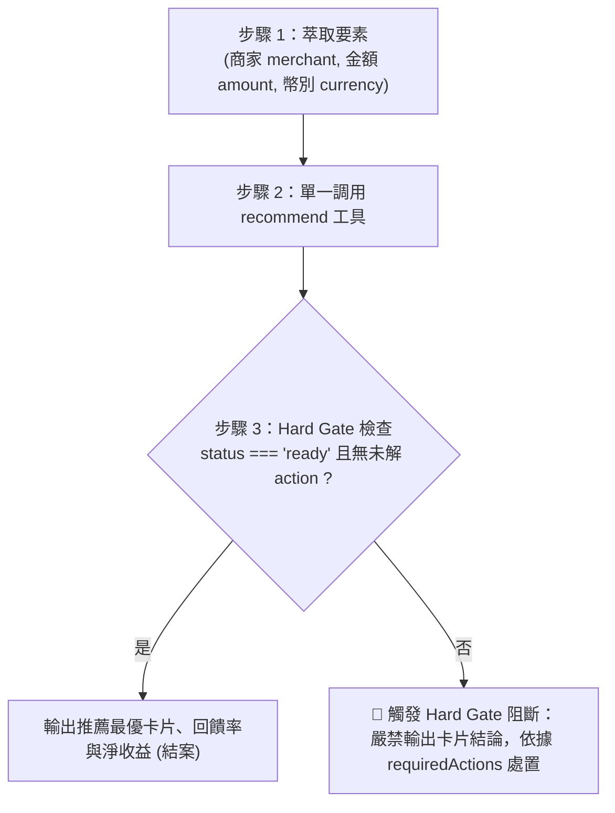

# 信用卡消費推薦黃金路徑 (Recommendation Golden Path)

本技能專注於消費前的**卡片比較、通路回饋與最佳支付路徑推薦**。

## 1. 任務工具視野 (Scoped Tools)
為避免認知干擾，本推薦任務**僅允許**使用以下唯讀查詢工具：
- `recommend`：核心推薦比價工具（計算命中規則、扣除海外手續費、剩餘回饋上限與排名）。
- `resolve_merchant`：僅在商家名稱有歧義（如「全家」有多個實體）時用於特店消歧義。
- 嚴禁在本推薦流程調用任何寫入型工具（如 `record_transaction`, `create_ingestion`）。

---

## 2. 黃金路徑三步驟 (The 3-Step Golden Path)

### 步驟 1：萃取消費三要素
從使用者輸入中解析以下資訊（缺少非關鍵資訊時使用預設值，不主動打斷詢問）：
- **商家/特店 (merchant)**：例如「唐吉訶德」、「全家便利商店」、「中華航空」。
- **預計消費金額 (amount)**：例如 `1000`。
- **幣別與通路 (currency / paymentMethod)**：預設 `TWD`；若提到日本消費填 `JPY`，若提到 Apple Pay 或行動支付則填入對應欄位。

### 步驟 2：調用 `recommend` 工具
將上述參數傳入 `recommend`，獲取比價結果。

### 步驟 3：Hard Gate 狀態守門員檢查
檢視 `recommend` 回傳的根層級欄位：

> [!IMPORTANT]
> ### 🚨 Hard Gate 強制阻斷準則 (Fail-Closed)
> 1. **狀態合格（`status === 'ready'` 且無 `requiredActions`）**：
>    - 依據 `candidates` 排名，直接向使用者輸出第 1 名推薦卡片、回饋趴數、預估淨回饋（扣除手續費）與回饋上限剩餘額度。
> 2. **狀態未定（`status !== 'ready'` 或 `requiredActions.length > 0`）**：
>    - **嚴禁向使用者輸出任何卡片排名或誘導性推薦！**
>    - 即使 `candidates` 中有部分試算數字，一律視為未定案。
>    - 依據 `requiredActions` 的指示處理：
>      - 若為 `action: "resolve_merchant"`：列出候選特店請使用者澄清，或調用 `resolve_merchant`。
>      - 若為 `action: "fx_resolution"`：參考 [`workflows/payment-route-and-fx.md`](workflows/payment-route-and-fx.md) 獲取即時牌告匯率。
>      - 待補齊要素後，帶入更新資訊重新調用 `recommend`，直到取得 `status === 'ready'` 為止。
