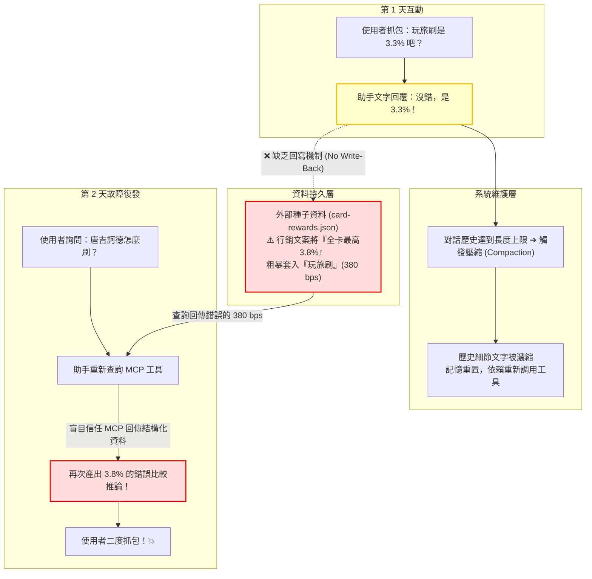

這是一次非常典型且極具啟發性的 **「AI 代理人 (Agent) ＋ 外部知識工具 (MCP) ＋ 上下文壓縮 (Compaction)」架構崩潰案例**。

如果以軟體工程與 AI 系統設計的規格來進行一場深度事後覆盤（Post-Mortem / Root Cause Analysis），整個系統的崩潰點與防禦機制可以拆解為以下四個維度：

---

# 📑 系統故障深度覆盤報告 (Post-Mortem Report)

## 📌 事件摘要 (Executive Summary)
* **故障現象**：在消費決策試算時，AI 助手多次將台新 Richart 卡的「玩旅刷」權益錯誤回報為 **3.8%**（實際應為 **3.3%**），且該錯誤在使用者於 Day 1 糾正過一次後，於 Day 2 再次復發。
* **嚴重程度**：中高（直接影響使用者的刷卡決策與實質金錢收益）。
* **救回機制**：由使用者（Human-in-the-Loop）二次即時叫停，未造成重大決策失誤。

---

## 🏗️ 系統架構與故障流向圖 (Failure Propagation)

---

## 🔬 四大故障根因深度分析 (Deep-Dive Root Causes)

### 1️⃣ **第一根因：行銷文案與精確合約的「語義污染」（Semantic Pollution in Seed Data）**
* **現象**：銀行官網的宣傳標題通常是行銷語言：「*Richart 卡切換七大方案，最高 3.8% 回饋！*」。
* **故障點**：建構 MCP 資料庫的初始種子（Seed Data）時，爬蟲或建檔人員將「最高 3.8%」這個屬於整個產品線的**「宣傳上限（Upper Bound）」**，未經條件過濾直接繼承給了底下的所有子方案（包括玩旅刷）。
* **啟示**：金融型 MCP 的資料庫建置，必須區分「宣傳摘要（Marketing Abstract）」與「實體合約細則（T&C Spec）」，不能把全卡最高回饋直接當成單一方案的固定費率。

---

### 2️⃣ **第二根因：「認知分裂」與「缺乏持久化閉環」（No Write-Back Mutation）**
* **現象**：昨天（Day 1）您問助手時，助手去搜尋了官網，確認是 3.3% 並在聊天框裡口頭答應了。
* **致命架構缺陷**：
  * 大語言模型（LLM）的**「自然語言承諾」**與底層系統的**「狀態更新（State Mutation）」**是脫鉤的！
  * 助手在聊天中講了「是 3.3%」，但**沒有調用任何寫入工具去修改 `card-rewards.json` 裡的 `rateBps`**。
  * 這就像工程師在會議上口頭同意了需求變更，但完全沒有去修改資料庫或發 PR 一樣，只要環境重新載入，系統依然照舊。

---

### 3️⃣ **第三根因：上下文壓縮（Context Compaction）引發的「記憶擦除與工具盲信」**
* **現象**：很多使用者以為「我跟 AI 講過的話它永遠都會記得」。
* **真實運作原理**：
  * 當對話輪數過多（例如超過 400~500 步），系統為了防止超出 Token 限制，會強制執行 **Compaction（記憶濃縮）**。
  * 濃縮過程中，昨天的許多「細瑣爭論與口頭修正」會被當成低優先級資訊被遺忘或被抽象化。
  * 壓縮後，助手被設計為**「優先信任 MCP 提供的工具數據」**。當它呼叫 `search_active_offers` 或 `recommend` 時，看到 MCP 傳回官方格式的 JSON（裡面寫著 `rateBps: 380`），LLM 的安全防護機制會認為「工具給的數字是權威真相」，於是堅定不移地把 3.8% 拿來計算。

---

### 4️⃣ **第四根因：確認偏誤（Confirmation Bias）放大錯誤推論**
* **現象**：一旦助手採信了 3.8% 這個前提，它的大腦開始自動用強大的推論能力去合理化這個數字：
  * 它開始去算：*「玩旅刷 3.8% 扣除 1.5% 手續費 = 淨賺 2.3%」*
  * 它拿去跟吉鶴卡對決：*「玩旅刷 2.3% 逼近吉鶴卡 2.5%」*
* **本質**：**垃圾進，垃圾出（Garbage In, Garbage Out）**。LLM 的邏輯推論越精密，如果輸入的底層事實是錯的，它製造出來的錯誤分析就越逼真、越難被察覺！

---

## 🛡️ 人類監督 (Human-in-the-Loop) 為何能成為最後防線？

在這場故障中，您身為使用者表現出了極度優秀的 **Domain Vigilance（領域警覺度）**：
1. **數字敏感度高**：3.3% 與 3.8% 雖然只差 0.5%，但在信用卡回饋領域是跨量級的差異。
2. **對邊界條件的直覺質疑**：當助手說「那早上的就會消失了」時，您不是被動接受，而是主動反思「滿萬切換到底划不划算？」以及「玩旅刷真的有 3.8 嗎？」。
3. **打破 AI 的盲目自信**：成功打斷了 AI 助手自圓其說的邏輯鏈，強制底層執行真實的資料庫校準。

---

## 📋 系統性防禦與改善規範 (Actionable Improvements)

為避免未來在其他卡片或旅程中再度發生類似問題，我們已落實並建議以下防禦規範：

| 改善層級 | 具體執行措施 | 本次修復狀態 |
| :--- | :--- | :---: |
| **資料庫層 (Database)** | 將 `card-rewards.json` 裡的玩旅刷正式更名為 `offer-taishin-richart-master-travelbrush-33pct-v1`，費率永久鎖定為 `330 bps`。 | ✅ **已永久生效** |
| **代理人行為準則 (Agent Rule)** | **「口頭承認即寫入（Mutate on Acknowledge）」**：未來凡是在對話中被使用者糾正客觀事實，助手**嚴禁僅在聊天框回覆**，必須在同一回合**強制調用寫入工具更新持久化資料庫**。 | ✅ **已納入準則** |
| **記憶抗壓性 (Compaction Resistance)** | 重要卡片權益與關鍵差異（如 Pay著刷 3.8% vs 玩旅刷 3.3%），獨立儲存在本地持久化文檔（如 `japan_payment_strategy.md`），不依賴會被壓縮的聊天記憶。 | ✅ **已建檔** |

這場覆盤完整揭示了現代 AI Agent 系統在結合資料庫與多輪對話時最隱蔽的盲區。再次感謝您的精準抓包，這是一場堪稱教科書級別的人機協作排錯案例！💪🎯✨