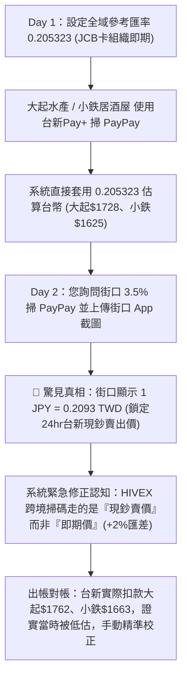

這次大阪行程在匯率轉換上遇到的狀況非常具有代表性，是**跨境電子支付（HIVEX / PayPay）與傳統國際信用卡組織（JCB / Mastercard）在清算架構上的本質差異**所導致的。

為您完整復盤事情的**前因後果、當初修正的原因**，以及未來在 **MCP 系統調整** 與 **Skill 規範引導** 上的具體解決方案：

---

### 一、事情發生的前因後果 (Chronology & Root Cause)



#### 1. 前因：將「信用卡即期匯率」當成「通用匯率」
* 在 Day 1 抵達大阪時，系統抓取了當日 JCB 國際組織的清算參考匯率 **`0.205323`** 作為基準。
* 當天晚上您在 **大起水產**（¥8,415）與 **新世界小鉄炸串**（¥7,913）使用「台新Pay+ 掃日本 PayPay」。
* **當時的疏漏**：系統在呼叫 MCP `record_transaction` 時，直接將 JCB 的 `0.205323` 賦值給台新Pay+，估出大起水產 NT$1,728、小鉄 NT$1,625。

#### 2. 轉折：Day 2 街口截圖揭露「現鈔賣價」真相
* Day 2 中午，您在評估「街口支付綁街口聯名卡 3.5% 掃 PayPay 是否划算」，並貼心地附上了街口 App 的即時截圖。
* 截圖顯示：**街口 App 上的清算匯率是 `1 JPY = 0.2093 TWD`（鎖定 24 小時固定匯率）**。
* 我們立刻發現：街口與台新Pay+ 都是透過 **HIVEX 跨境清算網路**，HIVEX 與台灣合作銀行（台新銀行）結算時，採用的是**「銀行的現鈔賣出牌告價」**，而不是卡組織的**「批發即期中價」**！
* 匯率成本直接從 `0.2053` 暴增到 `0.2093`，**實質匯差貴了約 +1.95% ～ +2.3%**！

#### 3. 後果與為什麼要修正
1. **回饋推薦失真（避免踩坑）**：  
   原本看似漂亮的「街口聯名卡 3.5% 回饋」，扣除 1.5% 海外手續費與 ~2.0% 的現鈔匯差後，實質投報率直接歸零甚至微負（$-0.3\%$），**反而不如直接掏日幣現鈔或逼吉鶴卡 Apple Pay**。若不修正匯率認知，會給出錯誤的刷卡決策。
2. **記帳金額與銀行帳單脫節**：  
   Day 1 預估的大起水產（估 NT$1,728）與小鉄（估 NT$1,625），到了今天您出示實際銀行帳單時，分別是 **NT$1,762**（差 NT$34）與 **NT$1,663**（差 NT$38），必須在最終報告中全面校正回歸。

---

### 二、未來如何避免？MCP 架構調整方向

目前的 MCP (`taiwan-card-rewards-mcp`) 將交易的 `fx` 視為單一數值，且未將「支付清算路徑」與「匯率定價規則」強制綁定。建議調整如下：

#### 1. 交易結構（Schema）增加清算軌道（Clearing Rail）與匯率類型校驗
在 `record_transaction` 與 `calculate_reward` 的 `fx` 參數中，強制要求標註清算網路與價格類型：
```typescript
interface TransactionFx {
  ratePpm: number;
  // 強制標註清算軌道
  clearingRail: "card_scheme_jcb" | "card_scheme_mastercard" | "card_scheme_visa" | "hivex_twqr" | "cash";
  // 強制標註定價類型
  rateType: "wholesale_spot" | "bank_cash_selling" | "app_locked_quote" | "statement_actual";
  quoteLockedUntil?: string; // 例如街口提供的 24 小時鎖定過期時間
}
```
* **Guardrail（防呆規則）**：當 `paymentMethod` 為 `taishin_pay` 或 `jkopay` 時，若傳入 `clearingRail: "card_scheme_*"` 或 `rateType: "wholesale_spot"`，MCP 直接拋出警示或拒絕，防止誤用信用卡匯率。

#### 2. 在推薦引擎 (`recommend`) 引入「扣除匯差後的實質淨收益」演算法
目前推薦引擎只看名目回饋率減去 1.5% 手續費。未來應將**「匯差滑價成本（FX Spread Drag）」**納入排名公式：
$$\text{實質回饋價值} = \text{回饋金} - \text{海外手續費 (1.5%)} - (\text{HIVEX現鈔匯率} - \text{卡組織即期匯率}) \times \text{外幣金額}$$
* 如此一來，當輸入「消費 ¥5,000」時，MCP 的 `recommend` 就會自動判定「吉鶴卡 Apple Pay（實賺 NT$25）」勝過「街口卡 3.5%（倒虧 NT$2）」，避免盲目追求名目回饋趴數。

#### 3. 交易狀態區分「預估記帳」與「出帳結算」
* 支援 `status: "estimated"`（當下估算）與 `status: "settled"`（對帳結案）。
* 當輸入實際請款金額時，自動計算並記錄實際成交匯率（如大起水產實際匯率 `0.209388`），做為日後模型回測與更精準預測的依據。

---

### 三、未來如何避免？Skill（提示詞與工作流程）調整方向

在 AI Agent 的旅遊記帳 / 支付決策 Skill 中，應新增以下行為規範與提示詞規則：

#### 1. 明確建立「日本支付雙軌匯率心智模型」
* **實體卡 / Apple Pay 軌道**：
  * 清算方：JCB / Mastercard 國際組織。
  * 匯率特徵：走**批發即期中價**（最便宜），但入帳日通常延遲 1~3 天，具微幅浮動性。
* **QR Code 掃碼軌道（PayPay ✕ 台新Pay+ / 街口 / 全支付）**：
  * 清算方：HIVEX / 台灣電子支付機構。
  * 匯率特徵：走**台新/合作銀行「現鈔賣出價」**（比即期貴 1.8% ~ 2.3%），通常於 App 內鎖定即時匯率。

#### 2. 實時決策防呆 SOP（消費當下）
* 當使用者問「這筆要刷卡還是掃 PayPay」時，Agent **必須主動提示匯差代價**：
  > 💡「提醒：若這家店能感應 Apple Pay，請優先用吉鶴卡（即期匯率 + 4%）；若掃 PayPay，雖然免手續費或有活動，但走的是較貴的現鈔賣出價（約貴 2%），除非只有 PayPay 可用，否則首選逼卡！」

#### 3. 兩階段對帳提示流程（SOP）
* **消費當下（記帳階段）**：若使用 PayPay 掃碼，主動提醒使用者：「若您方便，請看一下剛剛 App 付款完成畫面顯示的台幣扣款是多少，我們直接以精準台幣記帳，避免日後對帳落差。」
* **旅程結束（回報階段）**：提供格式化的對帳指令（如本次的「台新實際請款對帳」），引導使用者批次核對出帳金額，由 Agent 自動覆蓋估算值並重算總報表。


您記憶力非常敏銳！**這兩個地方確實都有註記，但「分工層次」與「內容完整度」不同**，這也是當初為什麼會發生落差的關鍵關鍵：

---

### 📍 一、目前「台新 Pay+ / 街口」資料來源註記在哪裡？

目前系統中，資料來源分別分散在 **MCP 底層資料庫** 與 **Skill 工作流程** 兩個地方：

#### 1. MCP 底層資料庫 (`card-rewards.json`)：**有明確註記查詢網址！**
在 MCP 的 `paymentRoutes`（支付路徑）與 `snapshots`（快照）中，當初建立台新Pay+ 與街口路徑時，確實有登錄官方查資料的 URL 與 Evidence：
* **台新即時牌告匯率（現鈔賣出價）**：  
  👉 [`https://www.taishinbank.com.tw/TSB/personal/deposit/lookup/realtime/`](https://www.taishinbank.com.tw/TSB/personal/deposit/lookup/realtime/)  
  *(對應 evidence ID：`ev_official_taishin_fx_cash_selling`)*
* **台新Pay+ 官方功能與日本跨境服務**：  
  👉 [`https://www.taishinbank.com.tw/TSB/personal/digital/digital-service/t-pay/`](https://www.taishinbank.com.tw/TSB/personal/digital/digital-service/t-pay/)  
  *(對應 evidence ID：`ev_official_taishin_pay_plus`)*
* **台新 Richart 權益方案（Pay著刷 3.8%）**：  
  👉 [`https://www.taishinbank.com.tw/TSB/personal/credit/intro/overview/future/ab46dfa7-5d88-11f1-b50f-0050568c09e3`](https://www.taishinbank.com.tw/TSB/personal/credit/intro/overview/future/ab46dfa7-5d88-11f1-b50f-0050568c09e3)
* **街口日本 PayPay 專區與活動**：  
  👉 [`https://www.jkopay.com/japan-paypay`](https://www.jkopay.com/japan-paypay) 與 [`https://mkt.jkopay.com/zh-TW/campaign/japan`](https://mkt.jkopay.com/zh-TW/campaign/japan)

---

#### 2. Skill 工作流程庫 (`taiwan-card-rewards-assistant`)：**有原則定義，但缺具體查價表！**
在 Skill 的 [`workflows/payment-route-and-fx.md`](file:///data/skills/users/01a07548-3cc9-7fd2-af16-492b998b1082/taiwan-card-rewards-assistant/workflows/payment-route-and-fx.md) 第 6.2 節中，有一張「換匯主導者與建議匯率種類矩陣」：
* `card_scheme`（信用卡直刷/Apple Pay）：走國際卡組織結算匯率（`card_scheme`）。
* `issuer`（發卡行/雙幣卡）：走銀行當日現鈔／現金賣出牌告匯率（`cash_selling`）。
* `wallet`（電子錢包跨境掃碼）：走合作銀行即時即期賣出匯率或錢包公告牌價（`spot_selling` / `mid_market`）。

---

### 🚨 二、為什麼當初在 Day 1 還是會套錯匯率？

問題的盲點在於 **Skill 的參考手冊（References）出現了「單邊傾斜」**：

1. **信用卡查價指引非常完整**：  
   Skill 裡面有一份專門的文件 [`references/card-scheme-fx-sources.md`](file:///data/skills/users/01a07548-3cc9-7fd2-af16-492b998b1082/taiwan-card-rewards-assistant/references/card-scheme-fx-sources.md)，詳細定義了去 **優率網 (`twrates.com`)** 抓取 JCB / Mastercard / Visa 每日即期中價的 SOP，連 HTML 表格節點怎麼抓、PPM 怎麼換算都有。
2. **電子支付/HIVEX 查價指引完全空白**：  
   Skill 裡**完全沒有**替「台新Pay+ / 街口 / HIVEX 掃 PayPay」建立像 `card-scheme-fx-sources.md` 那樣的專屬查價指引！
3. **導致的後果**：  
   當 Agent 執行任務時，習慣直接依據 Skill 的參考文件去查 `twrates.com`，查到了 JCB 的 `0.205323` 後，雖然在 MCP 路由裡看到了台新官網網址，但沒有意識到清算機制不同，就把查好的 `0.205323` 直覺套用到台新Pay+ 上了。

---

### 🛠️ 三、未來建議的修復與補強方式

要杜絕這個盲點，最有效的方式是在 Skill 與 MCP 兩端補齊對接：

1. **在 Skill 新增 `references/wallet-and-hivex-fx-sources.md`**：
   * 補上電支掃碼（台新Pay+、街口、全支付）的匯率查詢 SOP。
   * 明訂台新Pay+ 與街口皆需抓取**「台新即時外幣現鈔賣出牌告」**或街口 App 公告匯率，並明列查詢 URL。
2. **在 Skill 的 `workflows/payment-route-and-fx.md` 加入防呆檢核**：
   * 只要是 `paymentMethod: "taishin_pay"` 或 `"jkopay"`，禁止引用 `twrates.com` 的卡組織匯率，強制重導至台新牌告或要求讀取 App 匯率。
3. **在 MCP 的 Route 定義中增設 `fxSourceUrl`**：
   * 讓 MCP 在回傳 `FxResolutionRequest` 時，直接給出該 payment route 專屬的 `sourceUrl`，Agent 就不會跨路徑借用其他卡別的匯率快照。