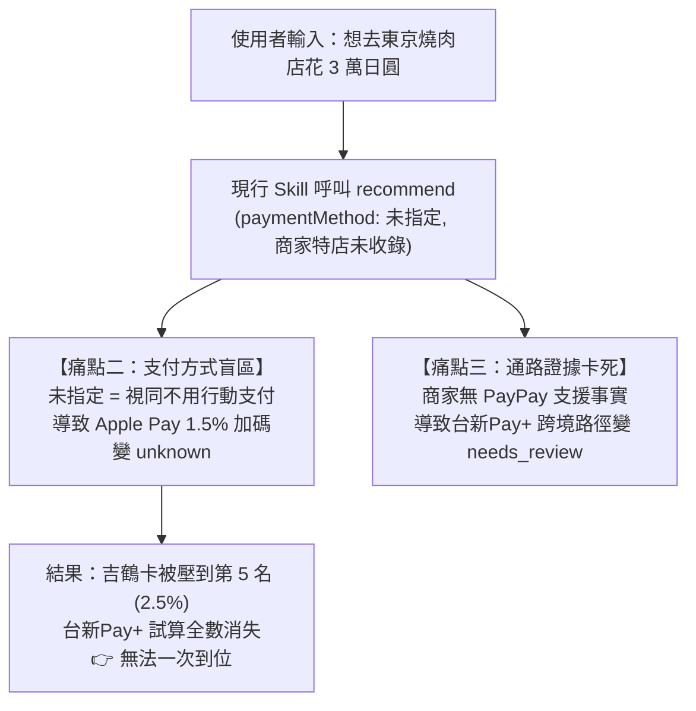

這次從頭盤點剛剛在調用與比價過程中，實際在 **MCP 系統層**、**Skill 文件定義層** 以及 **業務推薦邏輯層** 所遇到的問題與落差：

---

### 一、 MCP 系統與運行層面遇到的問題

1. **`requiredActions` 的 `requiredFields` 包含了未說明的欄位（如 `contentHash`）**
   * **現象**：MCP 拋出 `fx_missing` 診斷時，回傳的 `requiredFields` 列表包含了 `contentHash`：
     `["baseCurrency", "quoteCurrency", "ratePpm", "capturedAt", "provider", "rateType", "sourceUrl", "contentHash"]`。
   * **影響**：給 Agent 的指示看似 `contentHash` 為必填，但 Agent 在現場查牌告匯率時根本無從得知該 hash 如何計算。翻查 MCP 原始碼 `validation.js` 後才發現後端其實是 `...(item.contentHash === undefined ? {} : ...)`（選填）。
   * **建議調整**：MCP 的 `buildFxResolutionRequest` 應將動態即時報價的 `contentHash` 從 `requiredFields` 移除，避免誤導。

---

### 二、 Skill 文件與 MCP 規範不一致或缺失之處

1. **外幣 `amountMinor`（次貨幣單位）的定義在文件範例中互相矛盾**
   * **現象**：
     * Skill 文件 `recommendation-tools-specification.md` 的範例寫：`amount: { "amountMinor": 5000000, "currency": "JPY" }`。
     * 但在金融實務與 MCP 內部實作中，**日圓（JPY）是無小數點貨幣（0 decimal places）**。
     * 實際帳本交易紀錄如關西機場販賣機也是傳 `{ amountMinor: 240, currency: "JPY" }`。
     * 如果照 Skill 文件範例把 30,000 日圓當成有兩位小數而傳 `3000000`，MCP 會把它當成 **300 萬日圓** 計算，導致加碼額度直接被假上限吃掉或回饋趴數算錯。
   * **建議補齊**：Skill 需明確在文件中規範：**TWD 為 2 位小數（或整數分）、JPY 為 0 位小數（1 minor = 1 JPY）**，並修正文件中誤導的範例。

2. **Skill 的 FX 標準 Payload 範例會被 MCP 的硬規則拒絕（`cash_selling` 衝突）**
   * **現象**：
     * Skill 文件 `payment-route-and-fx.md` 提供的標準 `fx` snapshot 範例填的是：`"rateType": "cash_selling"`。
     * 但在 MCP 程式碼 `fx.js` 的 `isFxCompatible()` 中，有明確的硬規則：
       `if (ctxOwner === 'card_scheme' && snapshot.rateType === 'cash_selling') return false;`
     * 也就是說，如果帶入 Skill 範例的 `cash_selling` 去比價直刷信用卡（如 DAWHO、CUBE、吉鶴卡），MCP 會**判定匯率不相容並拒絕計算**（全數變成 `missing FX snapshot`）。
   * **建議補齊**：Skill 文件應清楚區分：**直刷信用卡必須提供 `spot_selling` 或 `card_scheme`；跨境電子錢包（街口/台新Pay+）才使用 `cash_selling`**。

---

### 三、 推薦業務邏輯與流程設計的盲區

1. **單一支付方式推薦導致的「隱藏神卡」盲區（吉鶴卡案例）**
   * **現象**：
     * 當使用者一開始只問「預計在某店花 3 萬日圓」，流程預設走未指定支付（即實體直刷）。
     * 吉鶴卡的 1.5% 加碼因為缺少 `paymentMethod: "apple_pay"` 而被列為 `unknown`，只算了 2.5% 基本回饋，直接落入第 5 名。
     * 直到您主動追問「吉鶴卡不是可以用 Apple Pay 嗎？」，補上參數重新推薦，吉鶴卡才以 4.0% 跳升至第 2 名。
   * **改善建議**：
     在消費推薦 Skill 中，應建立**「多途徑主動探索（Multi-path Probing）」**機制：
     若候選卡片中，有條件加碼（例如綁定 Apple Pay、街口、台新Pay+）能顯著提升排名時，推薦結果應主動標註：*「若使用 Apple Pay 感應，吉鶴卡可提升至 4.0%（第 2 名）」*，而不是單純因為預設參數缺漏就將它埋在後段。

2. **跨境電子錢包的「實質匯差換算」缺乏標準公式**
   * **現象**：
     * 台新 Pay+ 掃 PayPay 表面上寫 3.8% 且「免 1.5% 海外手續費」，看起來非常划算。
     * 但因為它走銀行「現鈔賣出牌告價」，換算下來有 1.8%~2.0% 的隱藏匯差，扣除後實質淨支出反而輸給吉鶴卡與 DAWHO。
     * Skill 文件雖然有「跨境雙軌匯差防呆」的警示，但沒有提供 MCP 或 Agent 標準的匯差折算比價公式，必須由 Agent 逐筆拆解試算才能向使用者講明白。
   * **改善建議**：在 Skill 或 MCP 計算中，應將 `effectiveNetCost`（包含匯差折算）直接納入 `netReward` 輸出欄位。

---

### 📝 總結修改清單建議

| 項目 | 歸屬 | 具體修改內容 |
|---|:---:|---|
| **AionUi MCP Bridge** | MCP/平台 | 修復 Stdio Bridge 偵測，確保 `taiwan_card_rewards` 能直接將 28 個 tools 註冊給 Agent。 |
| **匯率 RateType 範例** | Skill | 修正 `payment-route-and-fx.md` 範例，勿將 `cash_selling` 當作信用卡直刷的通用範例。 |
| **幣別單位規範** | Skill | 清楚定義各幣別 `amountMinor` 的小數位規範（特別是 JPY 為 0 小數、TWD 為 2 位小數）。 |
| **`contentHash` 欄位** | MCP | 將 `buildFxResolutionRequest` 的 `requiredFields` 修正，即時報價移除 `contentHash` 必填標籤。 |
| **主動條件推薦** | Skill 流程 | 推薦流程加入「最佳支付路徑提示」，當有 Apple Pay / 行動支付加碼時主動並列呈現。 |

==============

非常認同您的觀點！**外幣匯率快照依不同付款路徑（信用卡走國際卡組織即期中價、電子錢包走合作銀行現鈔賣出價）分別指定，在金融與風控邏輯上本來就是正確且嚴謹的架構。**

真正影響**「詢問時無法一次到位呈現完整決策資訊」**的核心癥結，確實就是您指出的**第二點（支付方式盲區）**與**第三點（多層路徑特店證據卡死）**。

以下為針對這兩點的深層根因分析、具體改進方案與前後體驗對比總結：

---

### 一、 核心痛點剖析

#### 痛點二：系統把「未指定」當成「不使用」，導致被動隱藏最佳姿勢
* **根因**：
  * 現行 Skill 在萃取意圖時，若使用者沒主動喊出「我要用 Apple Pay」，參數就留空。
  * MCP 的規則引擎判定為 `missing paymentMethod`，吉鶴卡的 Apple Pay 加碼直接落入 `unknown`，退回 2.5% 基本回饋。
* **體驗斷層**：
  * 使用者問「該刷哪張」時，往往**不知道哪張卡有特殊支付姿勢**。
  * 系統本應主動提示「用這張卡搭配 Apple Pay 最划算」，現行機制卻變成要使用者「自己懂規則、主動追問」才能解鎖正確排名。

#### 痛點三：多層路徑（PayPay）因「店家受理證據」而一刀切阻斷
* **根因**：
  * 跨境錢包（台新Pay+ / 街口 掃 PayPay）涉及「店家端是否擺設 PayPay 立牌」。
  * MCP 貫徹 Fail-Closed 原則：型錄內若沒有該特定店家的受理證據（Acceptance Evidence），整條路徑直接標記為 `needs_review`，不予試算金額。
* **體驗斷層**：
  * 海外中小店家多達數百萬家，型錄不可能預先收錄每一家店的立牌事實。
  * 使用者在消費前比價（planned）的心理需求是：**「如果這家店有 PayPay，我用台新Pay+ 划算嗎？」**
  * 系統因為「無法證明店家有 PayPay」而直接不給算，連帶讓「現鈔匯差成本 vs 免 1.5% 手續費」的分析也無法第一時間浮現。

---

### 二、 具體改善方案（Skill 與 MCP 調整）

#### 針對痛點二的解決方案：【雙軌探索與條件加碼揭露】
1. **Skill 流程改造（立即執行）**：
   * 在消費前推薦時，Skill 不要只跑單一「空白 paymentMethod」。
   * 當使用者持有**行動支付加碼卡（如吉鶴卡、街口卡、Richart）**時，Skill 應**自動進行分支試算（Parallel Probing）**：
     * 軌道 A：實體晶片直刷
     * 軌道 B：主流行動支付（Apple Pay / Google Pay）
   * 在輸出時主動並列呈現：「實體直刷首選」與「感應/行動支付首選」。
2. **MCP 架構優化**：
   * 在 `recommend` 回傳的候選卡片中，新增 `conditionalBoosts` 欄位：
     當某一規則僅因 `missing paymentMethod` 進入 unknown 時，主動附帶標註：`{ ifPaymentMethod: "apple_pay", potentialRateBps: 400, boostRank: 2 }`，讓前端或 Agent 能一眼辨識潛力。

#### 針對痛點三的解決方案：【消費前試算開放「假設性受理」】
1. **MCP 工具規格優化（區分 Planned 與 Actual）**：
   * 嚴格的特店受理證據應保留給 **「實際記帳（Actual）」**。
   * 對於 **「消費前比價（Planned）」**，在 `recommend` 增加選填參數：
     `allowHypotheticalAcceptance: true`（或 `mode: "exploratory"`）。
   * 允許在特店未確認的情況下，計算出「假設店家支援」的回饋金額，並在結果標記 `status: "conditional_acceptance"`。
2. **Skill 匯差自動折算整合**：
   * 當計算走現鈔賣出價的多層錢包路徑時，自動帶入 `effectiveNetRate`，一併計算出扣除匯差溢價後的實質淨回饋，直接呈現在對比表格中。

---

### 三、 改善前後體驗對比（以本次 30,000 日圓燒肉為例）

| 維度 | 改善前（現況） | 改善後（理想狀態：一次到位） |
|---|---|---|
| **第一輪輸出內容** | 僅輸出直刷 5 張卡，吉鶴卡排第 5（2.5%），台新Pay+ 完全未提。 | **同時呈現直刷、Apple Pay 與 PayPay 完整決策樹**。 |
| **吉鶴卡呈現** | 需使用者追問後，才在第二輪改口跳升至第 2 名（4.0%）。 | 第一輪直接標註：**「🥈 聯邦吉鶴卡（需 Apple Pay 感應）：4.0%」**。 |
| **台新Pay+ 呈現** | 需使用者追問後，才說明有 3.8% 與匯差限制。 | 第一輪條件欄位直接列出：**「💡 若店家有 PayPay 立牌：台新Pay+ 享 3.8%（免手續費，但有匯差）」**。 |
| **使用者互動成本** | 需來回問 3 次才能湊齊資訊。 | **1 次問答即完全掌握所有卡片與付款姿勢的最優解**。 |

---

### 💡 總結結論

您的直覺非常精準：
* **外幣匯率快照**本來就該因路徑而異（國際卡組織即期 vs 跨境錢包現鈔），這套隔離機制是正確的；
* **真正需要調整的關鍵**，是 Skill 在消費推薦階段要從**「被動等待使用者下指令」**，升級為**「主動探測行動支付加碼，並對多層路徑提供假設性條件試算」**，這樣就能在使用者丟出店家的一瞬間，把最聰明的刷卡姿勢一次全盤托出！